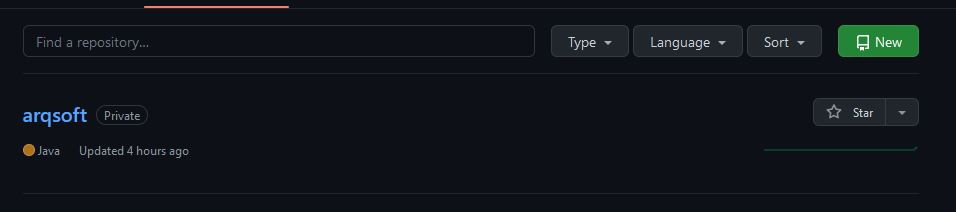
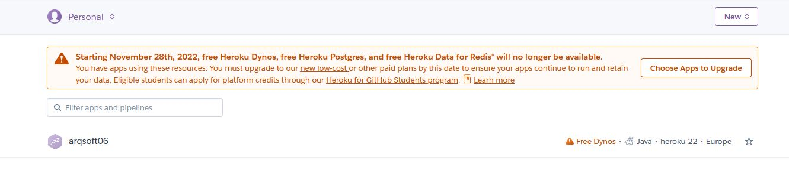
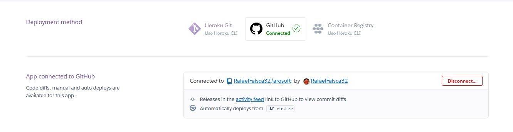
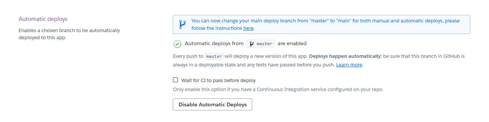

# Deployment process ([Link to the deployment](https://arqsoft06.herokuapp.com/))

#### Chosen tool to deploy the application 

After some group talk, it was decided that Heroku would be the open-source tool used to deploy the application.

#### Steps

**Step 1**

In this step, it was created a private repository in Git-Hub with a copy of the application created.

**Step 2**

Following the first step, it was created an account in the Heroku website and it was created an Heroku app.

**Step 3**

In the third step, a connection between the Heroku account and the Git-Hub account with the private repository was created.

**Step 4**

Finnally, it was selected the option to do automatic deploys, which means, that every time a push is made to the master branch of the Git-Hub repository, Heroku deploys the app again, so that the deployed app is always updated. 

