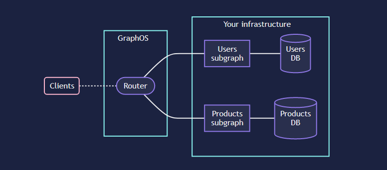

# Repository for Project 

## ARQSOFT 2022/2023

### Roadmap

The software being developed is a brownfield system, so it is proposed the following roadmap for each ADD iteration

**Iteration 1**

- Goal: Refine software architecture

- Description: In this iteration it is intended that the design of the previously developed software architecture is refined to include new architectural drivers

- Design Concepts:
  - Refine the Domain Model
  - Decompose the monolithic GFAB into a microservice-based application

**Iteration 2**

- Goal: Support quality attribute scenarios and concerns

- Description: In this iteration it is intended that the design of the quality attribute scenarios and concerns is settled

- Design Concepts:
  - Analyze, and choose Tactics
  - Relate Architectural and Deployment Patterns with choosen Tactics
  - Relate Externally Developed Components with choosen Tactics

**Note** 

- Despite having this organization some drivers might be related to each other and can possible be addressed in various iterations.

## **Architectural Drivers**

### **Design Purpose**
A well detailed plan for the migration of the monolith legacy system to a new micro-services model is to be designed, implemented, tested and deployed 
in order to promote the minimum amount of damage to the current system deployed

### **Quality Attributes**

| ID   | Scenario |Quality Attribute|Importance | Technical risk |
|---|---|---|---|---|
| QA-1           | The use of GraphQL is mandatory. |Architecture Performance |H |H |
| QA-2           | The prototype to be developed must be accessible using a web browser or a simple application that transfers data to and from a server that supports some protocols allowing the use of API, such as Curl and Postman.   |Accessability |H |M |
| QA-3           | A distributed Microservices architecture is the target.| Architecture Performance |H |M |
| QA-4           | The OpenAPI (Swagger) specification must be used for API documentation.. |Learnability |L |L |
| QA-5           | Only open-source tools and technologies are allowed, except some mentioned.  |Security Design |H |L |
| QA-6           | Maintainability is a characteristic that the team has to carefully consider during the architecture design. Appropriate metrics should be used. |Code Coverage |M |L |
| QA-7           | Testing on various quality dimensions is mandatory for the prototype, including the business rules captured in domain layers and what can ensure the correct functioning of the application and its API. More than the number of tests, it is important to explain and document what the tests allow to verify.|Code Coverage |H |M |

### **Primary Functionality**

| ID   | Use Case                                | Description                                                                                                  | Priority | Difficulty |
|------|-----------------------------------------|--------------------------------------------------------------------------------------------------------------|----------|------------|
| UC1  | Create Sandwiches                       | The sandwich is labeled with designation, price and a description with it's language                         | High     | Medium     |
| UC2  | List Sandwiches                         | View a characterization regarding the sandwich's designation, description and price                          | Medium   | Low        |
| UC3  | Register Shop                           | The shop is labeled with designation, an address, a manager and opening hours                                | High     | High       |
| UC4  | List Shop                               | View a characterization regarding the shop's designation, address and manager's name                         | Medium   | Low        |
| UC5  | Register Order                          | The order is labeled with specific day and shop, the items and their quantities                              | High     | High       |
| UC6  | List Order                              | View a characterization regarding the order's number, promotion, items, and price                            | Low      | Low        |
| UC7  | Register Customer                       | The register is labeled with name, a tax identification number, an address, an email and authentication data | High     | Low        |
| UC8  | List Customer                           | View a characterization regarding the customer's username, email, tax identification number, and address     | Low      | Low        |
| UC9  | Create promotion                        | The promotion is labeled with type, the percentage and time effect                                           | Medium   | Medium     |
| UC10 | List promotion                          | View a characterization regarding the promotion's type, percentage and time of effect                        | Low      | Low        |
| UC11 | Login                                   | The user logs in to the prototype                                                                            | High     | Low        |
| UC12 | Define N minimum/maximum of deliveries  | The shop can define the N minimum and maximum of deliveries for each period of N minutes                     | Medium   | Medium     |
| UC13 | List deliveries                         | The manager can list the deliveries for certain period of time                                               | Medium   | Medium     |
| UC14 | Register deliveries                     | The manager registers a delivery                                                                             | Medium   | High       |

### **Architectural Concerns**
Architectural concerns encompass additional aspects that need to be considered 
as part of architectural design but that are not expressed as traditional requirements.
They can be general, specific, internal or issues.

#### **General Concerns**
These are “broad” issues that one deals with in creating 
the architecture, such as establishing an overall system structure.

#### **Specific concerns**
These are more detailed system-internal issues such as 
exception management, dependency management, configuration, logging, 
authentication, authorization, caching, and so forth that are common across 
large numbers of applications.

#### **Internal Concerns**
These requirements are usually not specified explicitly in traditional requirement documents, as customers usually seldom 
express them. Internal requirements may address aspects that facilitate development, deployment, operation, or maintenance of the system. 

#### **Issues**
These result from analysis activities, such as a design review , so they may not be present initially. 
For instance, an architectural evaluation may uncover a risk that requires some changes to be performed in the current design.

Our concerns:

| ID              | Concern                                                                                             |
|-----------------|:----------------------------------------------------------------------------------------------------|
| CRN-1           | Accessible from web browser, Postman or Curl.                                                       | 
| CRN-2           | Establishing an overall initial system structure.                                                   |
| CRN-3           | Leverage the team's knowledge about Java technologies, including Spring, GraphQL, ASP.NET and also MongoDB knowledge. | 
| CRN-4           | Allocate work to members of the team.                                                               | 

### **Constrains**

| ID              | Constraint                                                                                          |
|-----------------|:----------------------------------------------------------------------------------------------------|
| CON-1           | Explore the microservice architecture.                                                             | 
| CON-2           | The prototype presentation must include the build and the execution at the command line.            | 
| CON-3           | Local method calls need to be replaced by synchronous remote calls, or better options.              |
| CON-4           | Service discovery is desirable.                                                                     |
| CON-5           | Direct dependencies in the databse are to be eliminated depending on the adopted data management strategies. |
| CON-6           | This prototype must be developed in the near six weeks.                                             |
| CON-7           | Integrate metrics (Sonargraph-Explorer).                                                            | 
| CON-8           | An on-prem solution is desirable with deployment based on containers                                |

## **Technologies Explorations**

# Microservices

Microservices are an architectural and organizational approach to software development where software is composed of small independent services that communicate over well-defined APIs. These services are owned by small, self-contained teams.
Microservices architectures make applications easier to scale and faster to develop, enabling innovation and accelerating time-to-market for new features.

## Why use microservices over monolithic architecture

With monolithic architectures, all processes are tightly coupled and run as a single service. This means that if one process of the application experiences a spike in demand, the entire architecture must be scaled. Adding or improving a monolithic application’s features becomes more complex as the code base grows. This complexity limits experimentation and makes it difficult to implement new ideas. Monolithic architectures add risk for application availability because many dependent and tightly coupled processes increase the impact of a single process failure.

With a microservices architecture, an application is built as independent components that run each application process as a service. These services communicate via a well-defined interface using lightweight APIs. Services are built for business capabilities and each service performs a single function. Because they are independently run, each service can be updated, deployed, and scaled to meet demand for specific functions of an application.

||
| :--: |
|*Breaking a monolithic application into microservices*|

## Benefits of Microservices

- Agility
    >Microservices foster an organization of small and independent teams. Teams act within a small and well understood context, and are empowered to work more independently and more quickly.
- Flexible Scaling
    >Microservices allow each service to be independently scaled to meet demand for the application feature it supports. This enables teams to right-size infrastructure needs, accurately measure the cost of a feature, and maintain availability if a service experiences a spike in demand.
- Easy Deployment
    >Microservices enable continuous integration and continuous delivery, making it easy to try out new ideas and to roll back if something doesn’t work.
- Technological Freedom
    >Microservices architectures don’t follow a “one size fits all” approach. Teams have the freedom to choose the best tool to solve their specific problems.
- Reusable Code
    >Dividing software into small, well-defined modules enables teams to use functions for multiple purposes. A service written for a certain function can be used as a building block for another feature. Because of this developers can create new functionalities withou writing the code from scratch.
- Resilence
    >Service independence increases an application’s resistance to failure. In a monolithic architecture, if a single component fails, it can cause the entire application to fail. With microservices, applications handle total service failure by degrading functionality and not crashing the entire application.

# GraphQL

## What is GraphQL

GraphQL is a query language for APIs and a runtime for fulfilling those queries with your existing data. GraphQL provides a complete and understandable description of the data in your API, gives clients the power to ask for exactly what they need and nothing more, makes it easier to evolve APIs over time, and enables powerful developer tools.

## Why use GraphQL over Rest API

- GraphQL is faster
    >GraphQL is way faster than other communication APIs because it facilitates you to cut down your request query by choosing only the specific fields you want to query.
- Best for complex systems and microservices
    >We can integrate multiple systems behind GraphQL's API. It unifies them and hides their complexity. The GraphQL server is also used to fetch data from the existing systems and package it up in the GraphQL response format. When we have to migrate from a monolithic backend application to a microservice architecture, the GraphQL API can help us to handle communication between multiple microservices by merging them into one GraphQL schema (gateway).
- No over-fetching and under-fetching problems
    >The main advantage of GraphQL over REST is that REST responses contain too much data or sometimes not enough data, which creates the need for another request. GraphQL solves this problem by fetching only the exact and specific data in a single request.

# Apollo

## What is Apollo

Apollo is a platform for building a supergraph, a unified network of all your data, services, and capabilities that connects to your application clients (such as web and native apps). At the heart of the supergraph it uses GraphQL.

## Apollo server

Apollo Server is an open-source, spec-compliant GraphQL server that's compatible with any GraphQL client. It's the best way to build a production-ready, self-documenting GraphQL API that can use data from any source.

 

