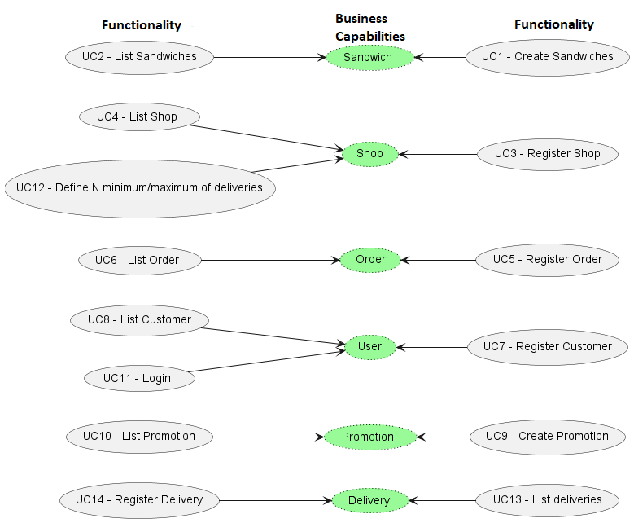
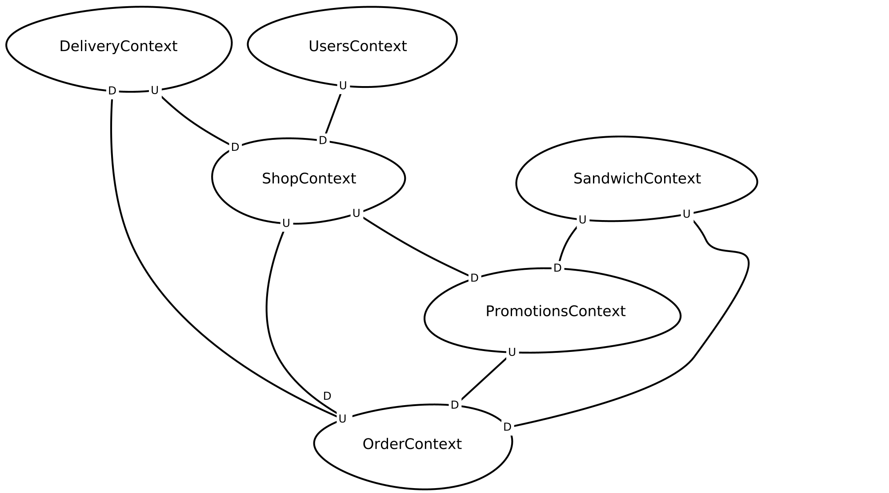
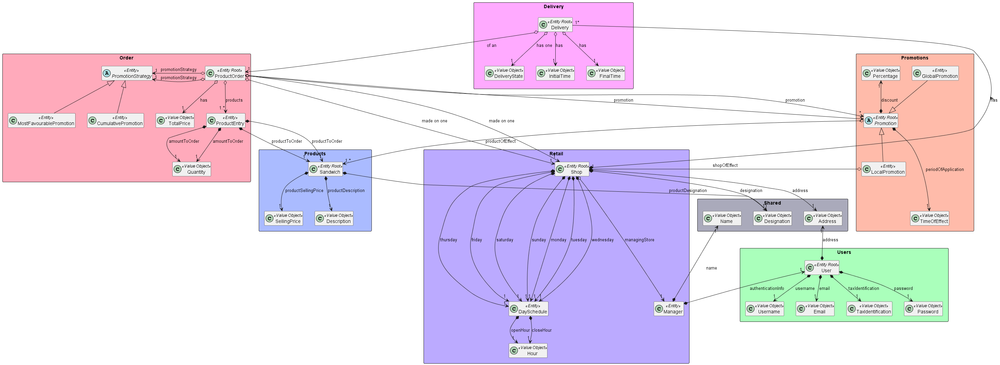
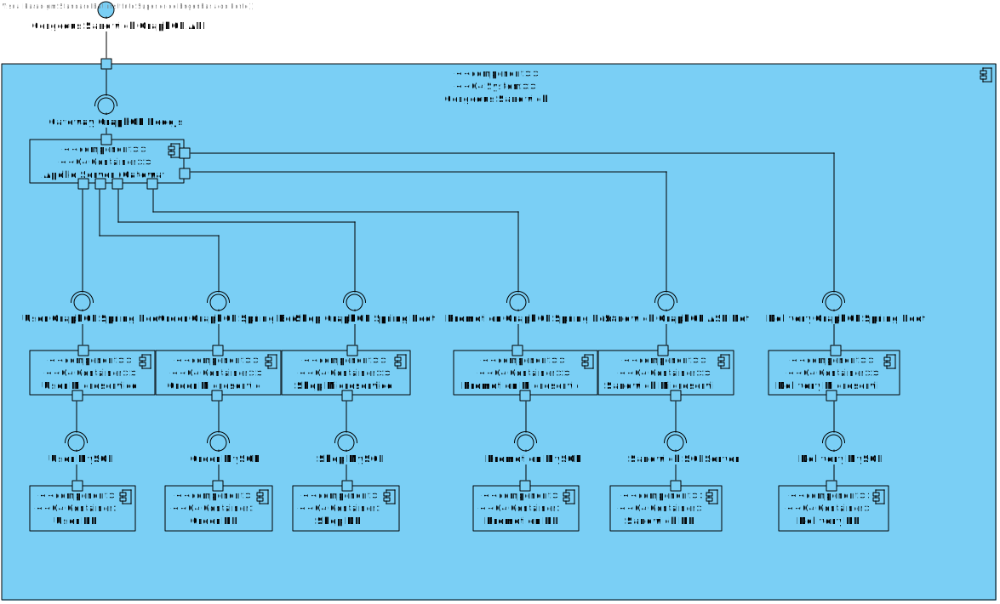
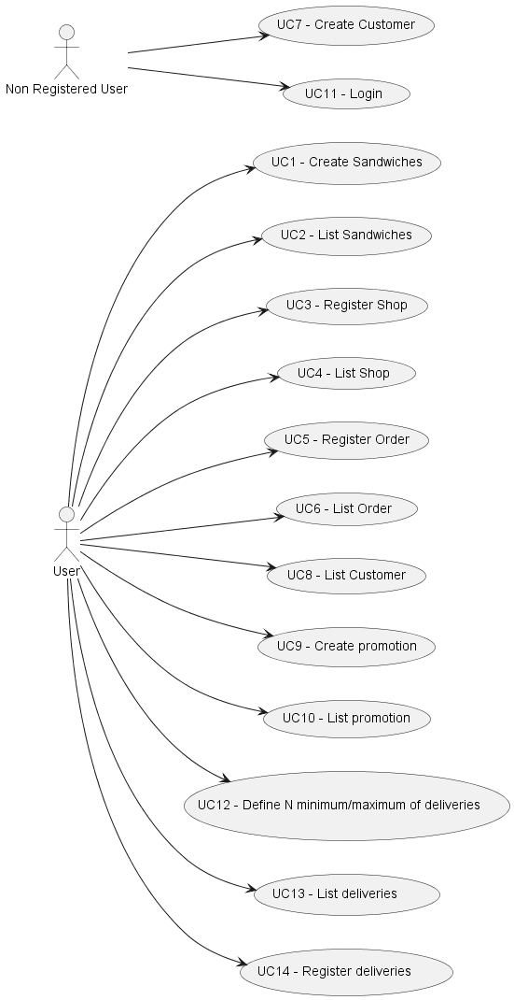

# Iteration 1

**Step 1**

- Goal: Review Inputs

- Possible Questions:

|Question|Answer|
|--------|------|
|Inputs available and correct?|As far as the feedback of the stakeholder, the defined architectural drivers are correct|
|All drivers available?|As far as what was retained from the domain problem and the stakeholder feedback, all drivers have been defined|
|Is it clearly stablished what is the purpose for the design activities?|Yes, the purpose of this iteration is to structure the software architecture in a coarse-view|
|Have primary functionality and quality attribute scenarios been prioritized (ideally by the most important project stakeholders)?|Yes, but in this iteration we will only scructure our system.|
|Are initial architectural concerns defined?|Yes|

**Step 2**

- Goal: Establish iteration goal by selecting drivers

#### Kanban Board

| Not Addressed | Partially Addressed | Addressed |
|---------------|---------------------|-----------|
| QA-1|||
| QA-3 |||
| QA-5|||
| CRN-2 |||
| CRN-3 |||
| CRN-4 |||
| CON-1 |||
| CON-2 |||
| CON-3 |||
| CON-4 |||
| CON-5 |||

**Step 3**

- Goal: Choose elements of the system to refine

Since we are working on a brownfield system, the main focus of this iteration is to support the new functionalities of the pre-existing GFAB component and split it into various microservices.

**Step 4**

- Goal: Choose one or more design concepts that satisfy the selected drivers

Given the iteration goal selected drivers in Step 2, it is necessary to define which design concepts will be taken in account to realize the elements to refine selected in Step 3. The design concepts proposed are the following:

|Design Decisions and Location|Rationale|
|-----------------------------|---------|
|Decompose the existing monolithic application by using business capability pattern|It is necessary to distinguish the GFAB business processes, and create a service to support each of its main functionalities|
|Decompose the existing monolithic application by using Sub-Domain pattern (Bounded Contexts)|For this approach we must split the GFAB domain into multiple smaller domains, each corresponding to a different business area.|
|Decompose the existing monolithic application with a supporting tool|For this approach we supply an external tool with the GFAB main concerns as input. The tool then outputs a possible decomposition into various services.|
|Apply microservices pattern to the output of monolith decomposition|It is obligatory to migrate the existing solution to microservices, so microservices pattern should be applied|
|Database Per Service|Keep each microservice's persistence data private to the service and acessible only via its API. The service’s database is not accessible directly by other services.|
|API Composition|The application performs the join rather than the database. For example, a service (or the API gateway) could retrieve a user and their orders by first retrieving the user from the user service and then querying the order service to return the user most recent orders.|
|Aim to build a gateway apollo server API|It is necessary to create an apollo server that will bring together all of our microservices |
|Use relational database.| A relational database is a database based on the relational model of data.|

|Alternative|Rationale|
|-----------------------------|---------|
|Command Query Responsibility Segregation (CQRS)|By following this design pattern, we can separate data-update versus data-querying capabilities into separate models. Maintaining one or more materialized views that contain data from multiple services. The views are kept by services that subscribe to events that each services publishes when it updates its data.|
|Shared Database|In this solution services share a common database; a service publishes its data, and other services can consume it when required. The Shared Database option could be viable only if the integration complexity or related challenges of Database per Service-based services become too difficult to handle; also, operating a single Shared Database is simpler.|
|Database View|With a view, a service can be presented with a schema that is a limited projection from an underlying schema- we limit the data that is visible to the service. It gives us control over what is shared, and what is hidden.|
|Change Data Capture|With change data capture, rather than trying to intercept and act on calls made into the monolith, we react to changes made in a datastore. For change data capture to work, the underlying capture system has to be coupled to the monolith’s datastore.|
|Spring Gateway, Apollo Gateway...| Since we use GraphQL in all our communications we felt that apollo server would fit great as our gateway and one element of our Team already worked with it and can pass knowledge.|
|Keep mongoDB(non relational database)|We chose to use non relational database this time around because the domain objects are already fixed and will not change and to our docker environments setup it was easier to do with SQL relational databases.|

**Step 5**

- Goal: Instantiate architectural elements, allocate responsibilities and define interfaces

To satisfy the structure of the chosen design concepts, the following elements are proposed to be created:

|Design Decisions and Location|Rationale|
|-----------------------------|---------|
|Elaborate refined domain model|In order to comprehend the new domain concepts of the iteration, it is necessary to establish a refined domain model with these concepts|
|Map use cases by actors|To establish actors and their responbilities it is necessary to map the use cases being addressed by their actors.|
|Map use cases to domain objects|Domain objects of use cases help in identifying the dependencies existent for each use case|
|Map system elements to logical components|As the monolith solution is being decomposed in new components it is necessary to map these as logical components in order to understand which interfaces are being produced and consumed by the components|
|Map system elements to physical components|As the monolith solution is being decomposed in new components it is necessary to map these as physical components in order to understand which communication protocols are being used in component communication|
|Structure packages of new components|By doing so, developers will have a better insight of the architecture and responsibilities of each component|

**Step 6**

- Goal: Sketch views and record design decisions

#### Business Capabilities Decomposition: 

Considering each Use Case a business function it's possible to describe business capabilities. Those are organized in the following table according the supplied information:

| Use Cases | Business Capability |
|--------------------------------------------------------------------------------------------------------------------------------------|----------------------|
|UC1- Create Sandwiches / UC2 -List Sandwiches | Sandwich |
|UC7-Register Customer / UC8 - List Customer / UC11-Login| User |
|UC3 - Register Shop / UC4 - List Shop / UC12-Define N minimum/maximum of deliveries| Shop |
|UC5-Register Order /  UC6- List Order | Order |
|UC13-List deliveries / UC14 - Register Delivery  | Delivery  |
|UC9-Create promotion / UC10-List promotion| Promotion  |

Justifications:

It's possible to decompose in at least 6 services. 

Some use cases need the interaction of more than one service thought. For example if we want to register an Order(UC-5) we will need to access Sandwiches or Shops that exist on our system.

It was thought a sixth service, with the addition of the Delivery. Previosly our domain had 5 aggregates but with more requirements from our client we feel the need to create a Delivery Aggregate that will going to be represented as a new microservice and Business Capability.

Other Use Cases are only contained in one service only and comply with Single Responsibility and Common Closure Principle (CCP).

   **Business Capabilities Decomposition Diagram**

  

#### Sub-Domain Decomposition:

Taking into account the monolith's domain, we were able to split it into 6 separate sub-domains, namely: **Sandwich**, **Promotion**, **Order**, **Shop**, **User** and **Delivery**.

Most of the bounded contexts will have an Upstream/Downstream relationship since the downstream end of the relationship depends on data or behavior of the upstream end. Meaning that the upstream end will influence the downstream context.

The **Order** bounded context will be responsible for creating the various orders regarding user needs. For this feature, we need to know the sandwich/es that the customer wants to buy the promotions selected and the Shop where he want to by it. 

The **Promotions** bounded context will be responsible for making the order price cheaper for the User. For this feature, we need to know the sandwich/es where the promotion applies and the stores where the promotion is available. 

The **Shop** bounded context will be the structure responsible for all the action. For this feature, we need to know the User that it's its Manager and the Deliveries it has to do. 

The **Delivery** bounded context will be responsible for completing an order. For this feature, we need to know the order we are delivering. 

   **Context Mapper Diagram**

   

#### Module View:

  **Aggregate Roots Diagram**

  

#### Component-and-connector View : 

   **Component Diagram**

   

#### Allocation View :

  **Use Case Diagram**

  

**Step 7**

- Goal: Perform analysis of current design and review iteration goal and achivements of design purposes

As the first step for this iteration, the domain model was refined in order to meet the stakeholder's new expectations.
Afterwards, the GFAB monolith was decomposed by following the Bounded Context (Sub-Domain) approach, which allowed the team to obtain a better understanding of the GFAB's main business capabilities, and each of the responsibilities of the newly created services. The existing REST API will be fractured in microservices next, using GraphQL this time around.

The following table represents the update of the kanban board after the iteration:

| Not Addressed | Partially Addressed | Addressed |
|---------------|---------------------|-----------|
| |QA-1||
| ||QA-3 |
| ||QA-5|
| ||CRN-2 |
|  ||CRN-3|
|  ||CRN-4|
|  ||CON-1|
|  ||CON-2|
|  ||CON-3|
| ||CON-4 |
| ||CON-5 |