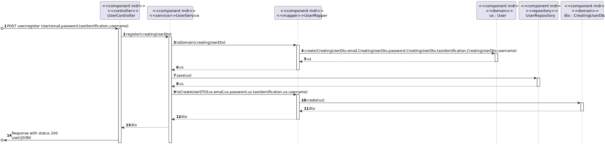
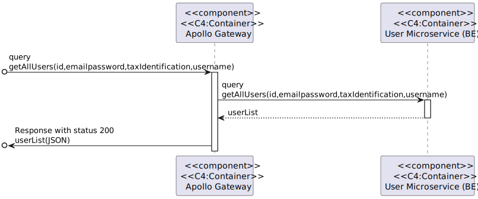
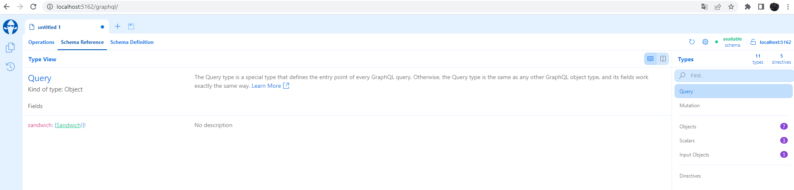

# Iteration 2

**Step 1**

- Goal: Review Inputs

- Possible Questions:

|Question|Answer|
|--------|------|
|Inputs available and correct?|As far as the feedback of the stakeholder, the defined architectural drivers are correct|
|All drivers available?|As far as what was retained from the domain problem and the stakeholder feedback, all drivers have been defined|
|Is it clearly stablished what is the purpose for the design activities?|Yes, it is to attack primary functionalities using DDD pattern.|
|Have primary functionality and quality attribute scenarios been prioritized (ideally by the most important project stakeholders)?|Yes, the primary functionalities with most importance initially are the register and login of an user.|
|Are initial architectural concerns defined?|Yes|

**Step 2**

- Goal: Establish iteration goal by selecting drivers

#### Kanban Board

| Not Addressed | Partially Addressed | Addressed |
|---------------|---------------------|-----------|
|  |QA-1||
| QA-2 |||
| QA-4 |||
| QA-6 |||
| QA-7 |||
| UC1 |||
| UC2 |||
| UC3 |||
| UC4 |||
| UC5 |||
| UC6 |||
| UC7 |||
| UC8 |||
| UC9 |||
| UC10 |||
| UC11 |||
| UC12 |||
| UC13 |||
| UC14 |||
| CRN-1 |||
| CON-6 |||
| CON-7 |||
| CON-8 |||

**Step 3**

- Goal: Choose elements of the system to refine

The goal of this iteration is to apply the design defined on iteration 1, finally doing the microservices and gateway API. We will also change our REST API structure and use GraphQL so the UC's made in GFAB will be refactared. In order to realize this design it is necessary to refine the following elements:

- GFAB (Gorgeous Food Application Back-end), which is the monolothic backend of GFA, breaking it down into microservices. In the end, this component will no longer exist.
- UserAPI, which is the microservice responsible for the User.
- ShopAPI, which is the microservice responsible for the Shop.
- PromotionAPI, which is the microservice responsible for the Promotion.
- OrderAPI, which is the microservice responsible for the Order.
- DeliveryAPI, which is the microservice responsible for the Delivery.
- SandwichAPI, which is the microservice responsible for the Sandwich.
- ApolloGatewayAPI, which is the componente that will connect all the microservices as our gateway.

**Step 4**

- Goal: Choose one or more design concepts that satisfy the selected drivers

Given the iteration goal selected drivers in Step 2, it is necessary to define which design concepts will be taken in account to realize the elements to refine selected in Step 3. The design concents proposed are the following:

|Design Decisions and Location|Rationale|
|-----------------------------|---------|
|Use 3 tier deployment pattern to physically architecture GFA|The 3 tier deployment pattern fits the needs of the requirements of GFA, in which there is a tier for our ApolloGatewayAPI, a tier for the respective microservice and a tier for the database |
|Use .NET for the SandwichAPI microservice|The stakeholders suggested that we should use more than one programming language for different microservices. For this reason we chose the Sandwich entity for this since it doesn't depende on any other service. |
|Deploy all our components and their databases into Docker| Docker is an open platform for developing, shipping, and running applications. Docker enables you to separate your applications from your infrastructure so you can deliver software quickly. In this case we will deploy all our components into docker.|
|Use Sonargraph Explorer.|	The core idea is to have a better understanding of our application using a powerful static analysis tool with a focus on metrics and dependency visualization.|
|Use Voyager, Sandbox,Banana Cake Pop and Graphqli to have instructions clear to others.|Those tools allows you to describe the structure of your APIs so that machines can read them. It makes that information available for the client using it and easier to undertand. |
|Unit testing and integration testing using Postman.| The more coverage an application has the more reliable it is.|

|Alternative|Rationale|
|-----------|---------|
| Node.js for building SandwichAPI | The element of our time who got this microservice has a better understanding of C#. |
| Deploy the application on Azure, AWS or ISEP servers|Since we are using microservices, deploying them all into those external resources would cost money. |
| Use Swagger | Swagger is only available if we used REST but all our components use GraphQL|
| Sonarqube | The process of integrating Sonarqube to the application is more complex than Sonargraph Explorer. Sonargraph Explorer was also suggested by the stakeholders. |

**Step 5**

- Goal: Instantiate architectural elements, allocate responsibilities and define interfaces

To satisfy the structure of the chosen design concepts, the following elements are proposed to be created:

|Design Decisions and Location|Rationale|
|-----------------------------|---------|
|Decompose GFAB in microservices| Our REST API application needs to be fractured into different components.|
|Change all the microservices into using GraphQL | It was requested from the stakeholders GraphQL usage.|
|Elaborate ApolloGatewayAPI| To explicit the specification of the produced functionalities so consumers can understand how requests and responses are performed and structured and bind all microservices together .|
|Deploy all the components into Docker.| Process of deploying our application and its documentation.|

**Step 6**

- Goal: Sketch views and record design decisions

#### Module View : 

   **Packages Diagram of Microservices**
   
   

#### Component & Connector View :

   **Components Diagram Fine-Grain View of all microservises except Sandwich**
   
   

   **Components Diagram Fine-Grain View of Sandwich microservice .NET**

   

   **Components Diagram Fine-Grain View of ApolloServerAPI gateway**

   
   

#### Allocation View :

   **Deployment Diagram**
    
   

- Responsability Table for Defined Elements

|Element|Responsibility|
|-------|--------------|
|GFU (Gorgeous Food User)|Service responsible for providing the functionalities related to `User` aggregate root|
|GFS (Gorgeous Food Sandwich)|Service responsible for providing the functionalities related to `Sandwiche` aggregate root|
|GFO (Gorgeous Food Order)|Service responsible for providing the functionalities related to `Order` aggregate root|
|GFP (Gorgeous Food Promotion)|Service responsible for providing the functionalities related to `Promotion` aggregate root|
|GFSH (Gorgeous Food Shop)|Service responsible for providing the functionalities related to `Shop` aggregate root|
|GFD (Gorgeous Food Delivery)|Service responsible for providing the functionalities related to `Delivery` aggregate root|
|GFG (Gorgeous Food Gateway)|Service responsible for binding all the microservices above, our gateway.|
|GFUD (Gorgeous Food User Database)|Database responsible for storing the information managed by the GFU Service|
|GFSD (Gorgeous Food Sandwich Database)|Database responsible for storing the information managed by the GFS Service|
|GFOD (Gorgeous Food Order Database)|Database responsible for storing the information managed by the GFO Service|
|GFPD (Gorgeous Food Promotion Database)|Database responsible for storing the information managed by the GFP Service|
|GFSHD (Gorgeous Food Shop Database)|Database responsible for storing the information managed by the GFSH Service|
|GFDD (Gorgeous Food Delivery Database)|Database responsible for storing the information managed by the GFD Service|
|API Gateway|This layer enables communication with remote services. It is responsible for managing requests and responses to and from objects of the domain|
|Enterprise Business|Also known as Entity Layer , represents the business rule.|
|Application Business|Also known as Use Case Layer represent the rules related to the automatization of our system. |
|Interface Adapters|Our business should deal only with the most convenient data format for it, and so should our external agents, as DBs or UIs. But, this format usually is different. For this reason, the interface adapter layer is responsible for converting the data.|
|Framework and Drivers Layers)|In truth, we don't code here. That is because this layer represents the lowest level of connection to external agents. For example, the driver to connect to the database or the web framework. In this case, we're going to use spring-boot as the web and dependency injection framework.|
|Sandwich (Model)|Produces models and functionalities related to `Sandwich` aggregate root|
|Shop (Model)|Produces models and functionalities related to `Shop` aggregate root|
|Order (Model)|Produces models and functionalities related to `Order` aggregate root|
|User (Model)|Produces models and functionalities related to `Users` aggregate root|
|Promotion (Model)|Produces models and functionalities related to `Promotion` aggregate root|
|Delivery (Model)|Produces models and functionalities related to `Delivery` aggregate root|

## Generic CRUD behaviour within the UserAPI component that demonstrates Onion Architecture

## Generic CRUD behaviour within our app that demonstrates the communication between gateway and microservices

## Simplify API

### Banana Cake Pop
Banana Cake Pop is a GraphQL tool that makes it easy and enjoyable to test your GraphQL server implementations. It works well with Hot Chocolate and any other GraphQL server.
It lets us see our query, mutation and objects.

And we can also do requests

### Voyager
Voyager is a GraphQL tool that gives us the general idea of our domain, shows as its objects, queries, mutations or subscriptions. When we have a large domain on our application it gives us a lot of help.

### Sandbox
Sandbox is pretty similar to Banana Cake Pop and it's embedded in our gateway.

## Tests

Unit tests to all the new components were added(SandwichAPI and DeliveryAPI) and Integration tests were created. Our unit tests are made to verify that the our Domain Objects will be created without errors,they verify Business Rules. It doesn't make sense to create a sandwich with a number below 0 for example.

Our integration tests with the use of Postman let us know if the communication between components it's working and if the results given to us are correct.

### Unit Tests Sandwich

### Integration Tests Sandwich(requests to the gateway)

**Step 7**

- Goal: Perform analysis of current design and review iteration goal and achivements of design purposes

In this iteration we successfully transformed our monolithic GFAB into a microservice-based application with a gateway using GraphQL, test it and deploy it to Docker.

The following table represents the update of the kanban board after the iteration:

| Not Addressed | Partially Addressed | Addressed |
|---------------|---------------------|-----------|
| ||QA-1|
| ||QA-2 |
|  ||QA-4(other API's for GraphQL)|
|  ||QA-6|
|  ||QA-7|
|  ||UC1|
| ||UC2 |
| ||UC3 |
|  ||UC4|
|  ||UC5|
|  ||UC6|
|  ||UC7|
|  ||UC8|
|  ||UC9|
|  ||UC10|
|  ||UC11|
| UC12 |||
| UC13 |||
| UC14 |||
|  ||CRN-1|
| ||CON-6 |
|  ||CON-7|
|  ||CON-8|